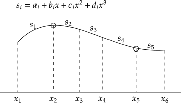

# 三次样条插值

当有 $N$ 个数据点，存在 $N-1$ 个间隔，每个间隔由一个三次函数表示
$$ s_i = a_i + b_i x + c_i x^2 + d_i x^3 $$

插值结果是一分段函数，通过每一个数据点且在每个节点处连续
$$
\begin{equation}
\begin{split}
& s_i(x_i) = s_{i-1}(x_i)  = y_i \\
& s_i^\prime(x_i) = s_{i-1}^\prime(x_i) \\
& s_i^{\prime\prime}(x_i) = s_{i-1}^{\prime\prime}(x_i) \\
\end{split}
\end{equation}
$$

**not-a-knot** boundary condition resuires $s_1^{\prime\prime\prime}(x_2) \equiv s_2^{\prime\prime\prime}(x_2)$ and $s_4^{\prime\prime\prime}(x_5) \equiv s_5^{\prime\prime\prime}(x_5)$

In total $4(N-1)$ parameters $\{(a_i, b_i, c_i, d_i)|i=1,2,\cdots\}$ can be obtained via matrix algebra (take above figure as example, 5 polynomial, 20 parameters to determine):

$$\begin{bmatrix}
1 & x_1 & x_1^2 & x_1^3 & \\
1 & x_2 & x_2^2 & x_2^3 & \\

  &     &       &       & 1 & x_2 & x_2^2 & x_2^3 & \\
  &     &       &       & 1 & x_3 & x_3^2 & x_3^3 & \\

  &     &       &       &   &     &       &       & 1 & x_3 & x_3^2 & x_3^3 & \\
    &     &       &       &   &     &       &       & 1 & x_4 & x_4^2 & x_4^3 & \\

  &     &       &       &   &     &       &       &   &     &       &       & 1 & x_4 & x_4^2 & x_4^3 &  \\
    &     &       &       &   &     &       &       &   &     &       &       & 1 & x_5 & x_5^2 & x_5^3 &  \\

  &     &       &       &   &     &       &       &   &     &       &       &       &       &   &     & 1 & x_5 & x_5^2 & x_5^3 & \\
    &     &       &       &   &     &       &       &   &     &       &       &       &       &   &     & 1 & x_6 & x_6^2 & x_6^3 & \\

0 & 1 & 2x_2 & 3x_2^2 & 0 & -1 & -2x_2 & -3x_2^2 & \\
  &   &      &        & 0 & 1 & 2x_3 & 3x_3^2 & 0 & -1 & -2x_3 & -3x_3^2 & \\
  &   &      &        &   &   &      &        & 0 & 1 & 2x_4 & 3x_4^2 & 0 & -1 & -2x_4 & -3x_4^2 & \\
  &   &      &        &   &   &      &        &   &   &      &        & 0 & 1 & 2x_5 & 3x_5^2 & 0 & -1 & -2x_5 & -3x_5^2 & \\

0 & 0 & 2 & 6x_2 & 0 & 0 & -2 & -6x_2 \\
  &   &   &      & 0 & 0 & 2 & 6x_3 & 0 & 0 & -2 & -6x_3 \\
  &   &   &      &   &   &   &      & 0 & 0 & 2 & 6x_4 & 0 & 0 & -2 & -6x_4 \\
  &   &   &      &   &   &   &      &   &   &   &      & 0 & 0 & 2 & 6x_5 & 0 & 0 & -2 & -6x_5 \\

0 & 0 & 0 & 6 & 0 & 0 & 0 & -6 \\
  &   &   &      &   &   &   &      &   &   &   &      & 0 & 0 & 0 & 6 & 0 & 0 & 0 & -6 \\
\end{bmatrix} \cdot \begin{bmatrix}
a_1 \\
b_1 \\
c_1 \\
d_1 \\

a_2 \\
b_2 \\
c_2 \\
d_2 \\

a_3 \\
b_3 \\
c_3 \\
d_3 \\

a_4 \\
b_4 \\
c_4 \\
d_4 \\

a_5 \\
b_5 \\
c_5 \\
d_5 \\
\end{bmatrix} = \begin{bmatrix}
y_1 \\
y_2 \\
y_2 \\
y_3 \\
y_3 \\
y_4 \\
y_4 \\
y_5 \\
y_6 \\
\vdots \\
0 \\
\end{bmatrix}$$

This is equivalent to:

$$\begin{equation}
\begin{split}
& a_1 + b_1 x_1 + c_1 x_1^2 + d_1 x_1^3 = y_1 \\
& a_1 + b_1 x_2 + c_1 x_2^2 + d_1 x_2^3 = y_2 \\
& a_2 + b_2 x_2 + c_2 x_2^2 + d_2 x_2^3 = y_2 \\
& a_2 + b_2 x_3 + c_2 x_3^2 + d_2 x_3^3 = y_3 \\
& a_3 + b_3 x_3 + c_3 x_3^2 + d_3 x_3^3 = y_3 \\
& a_3 + b_3 x_4 + c_3 x_4^2 + d_3 x_4^3 = y_4 \\
& a_4 + b_4 x_4 + c_4 x_4^2 + d_4 x_4^3 = y_4 \\
& a_4 + b_4 x_5 + c_4 x_5^2 + d_4 x_5^3 = y_5 \\
& a_5 + b_5 x_5 + c_5 x_5^2 + d_5 x_5^3 = y_5 \\
& a_5 + b_5 x_6 + c_5 x_6^2 + d_5 x_6^3 = y_6 \\

& b_1 + 2c_1 x_2 + 3d_1 x_2^2 = b_2 + 2c_2 x_2 + 3d_2 x_2^2 \\
& b_2 + 2c_2 x_3 + 3d_2 x_3^2 = b_3 + 2c_3 x_3 + 3d_3 x_3^2 \\
& b_3 + 2c_3 x_4 + 3d_3 x_4^2 = b_4 + 2c_4 x_4 + 3d_4 x_4^2 \\
& b_4 + 2c_4 x_5 + 3d_4 x_5^2 = b_5 + 2c_5 x_5 + 3d_5 x_5^2 \\

& 2c_1 + 6d_1 x_2 = 2c_2 + 6d_2 x_2 \\
& 2c_2 + 6d_2 x_3 = 2c_3 + 6d_3 x_3 \\
& 2c_3 + 6d_3 x_4 = 2c_4 + 6d_4 x_4 \\
& 2c_4 + 6d_4 x_5 = 2c_5 + 6d_5 x_5 \\

& 6d_1 = 6d_2 \\
& 6d_4 = 6d_5 \\
\end{split}
\end{equation}$$

20 equations, 20 variables, this is solvable. 